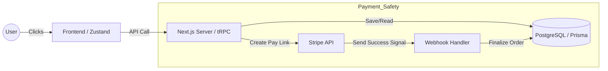

# Mini-Commerce: Simple & Fast E-commerce

A full-stack e-commerce site built with **Next.js 16** and **React 19**.
The main goal of this project is to solve the most common problem in online shops: **"How to keep orders and payments in sync."**

## 1. Project Goal

To handle "State Sync." I want to make sure that even if a user’s internet drops or they close the browser, the payment and order data stay 100% correct.

## 2. Tech Stack

- **Next.js 16 (App Router):** Using Server Components to make the page load faster and improve SEO.
- **tRPC:** For **Full Type-Safety**. I chose this because if I change something in the backend, the frontend tells me immediately. This stops many bugs before they happen.
- **Prisma + Neon:** Makes database work easy and safe. No more messy SQL errors.
- **Zustand:** A very light way to manage the shopping cart. It is faster than Redux and keeps the app snappy.
- **Stripe:** For secure payments and **Webhook** handling.

## 3. Engineering Highlights

- **Reliable Checkout:** I use **Stripe Webhooks** as the "Source of Truth." If a user pays but their browser crashes, my server still gets a signal from Stripe and finishes the order in the background.
- **No Half-Finished Data:** Using Prisma Transactions. This means "reducing stock" and "creating an order" happen together. If one fails, both fail. This keeps the data clean.
- **Clean Code:** I use ESLint and Prettier to keep the code easy to read for the whole team.

## 4. Data Flow



## 5. Quick Start

To get the Mini-Commerce project up and running locally, follow these three simple steps:

**Prerequisites:** Ensure you have Node.js (v20+), and Yarn (or npm) installed on your system.

1.  **Environment Setup:**
    - Copy the example environment file: `cp .env.sample .env`
    - Edit `.env` and configure the necessary environment variables, including `DATABASE_URL`, `DIRECT_URL`, `NEXTAUTH_SECRET`, `AUTH_SECRET`, `AUTH_GOOGLE_ID`, `AUTH_GOOGLE_SECRET`, `STRIPE_SECRET_KEY`, `STRIPE_WEBHOOK_SECRET` and `NEXT_PUBLIC_STRIPE_PUBLIC_KEY`.
2.  **Database & Dependencies:**
    - Install project dependencies: `yarn install` (or `npm install`)
    - Apply Prisma database migrations and seed the database:
      ```bash
      yarn prisma migrate dev
      yarn prisma db seed
      ```
3.  **Run Development Server:**
    - Start the Next.js development server: `yarn dev` (or `npm run dev`)

The application will now be accessible at `http://localhost:3000`.
